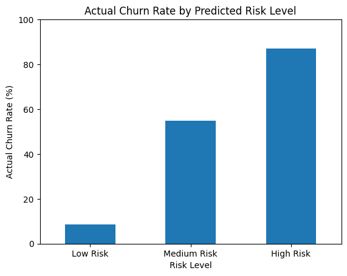

# Customer Churn & Retention Analytics

## Overview

This project analyzes customer churn for a telecommunications dataset and develops a predictive risk-segmentation framework to help prioritize customer retention efforts.

The analysis combines exploratory data analysis, customer segmentation, and machine learning to identify churn drivers and classify customers based on their predicted likelihood of churn.

## Business Problem

Customer churn can significantly affect recurring revenue and customer lifetime value. The objective of this project is to:

- Identify customer segments with elevated churn rates
- Analyze characteristics associated with customer attrition
- Build a model to estimate individual customer churn probability
- Segment customers into actionable risk categories
- Translate analytical findings into retention recommendations

## Dataset

The project uses the publicly available IBM Telco Customer Churn sample dataset.

The dataset contains 7,043 customer records and 23 original attributes covering:

- Customer demographics
- Tenure
- Contract type
- Internet and phone services
- Additional services
- Payment methods
- Monthly and total charges
- Customer churn

The dataset represents a fictional telecommunications provider and is used as a case study for customer analytics.

## Methodology

### 1. Data Preparation

- Loaded the dataset using Pandas
- Inspected data types and missing values
- Converted `TotalCharges` to a numerical format
- Handled 11 non-numeric/blank `TotalCharges` entries
- Encoded categorical variables using one-hot encoding
- Removed `customerID` from model features

### 2. Exploratory Analysis

Key churn patterns were analyzed across:

- Contract type
- Customer tenure
- Monthly charges
- Internet service
- Technical support
- Combined customer segments

### 3. Predictive Modeling

A Logistic Regression model was trained using an 80/20 stratified train-test split.

Model performance:

- Accuracy: 86%
- Churn precision: 76%
- Churn recall: 68%
- Churn F1-score: 72%
- ROC-AUC: 0.928

### 4. Risk Segmentation

Customers were assigned risk levels based on predicted churn probability:

- Low Risk: <40%
- Medium Risk: 40–70%
- High Risk: ≥70%

The model's risk segmentation was evaluated against actual churn outcomes.

## Key Findings

### Contract Type

Month-to-month customers showed a 42.71% churn rate compared with only 2.83% for two-year contract customers.

### Customer Tenure

Customers with 0–12 months of tenure showed a 47.68% churn rate, compared with 9.51% among customers with 49–72 months of tenure.

### Highest-Risk Segment

Customers with both:

- Month-to-month contracts
- 0–12 months of tenure

showed a 51.35% churn rate.

### Internet Service

Fiber-optic customers showed a 41.89% churn rate compared with 18.96% for DSL customers.

Fiber customers also had higher average monthly charges ($91.50) and a larger proportion of month-to-month contracts (68.7%).

### Technical Support

Customers without technical support showed a 41.64% churn rate compared with 15.17% among customers with technical support.

## Risk Segmentation Visualization

The model's predicted risk levels show strong separation in observed churn behavior:



## Predictive Risk Segmentation

The model produced the following results on the held-out test set:

| Risk Level | Customers | Actual Churn |
|---|---:|---:|
| Low Risk | 999 | 8.5% |
| Medium Risk | 210 | 54.8% |
| High Risk | 200 | 87.0% |

The strong separation between risk groups indicates that predicted churn probability can be used to prioritize retention resources.

## Business Recommendations

Based on the analysis:

1. **Prioritize new month-to-month customers**  
   Develop early-stage onboarding and retention interventions for customers in their first year.

2. **Use predictive risk scores for targeted retention**  
   Prioritize customers with high predicted churn probability rather than applying identical retention strategies across the entire customer base.

3. **Investigate elevated fiber churn**  
   Further investigate whether pricing, service experience, or contract structure contributes to the high churn observed among fiber customers.

4. **Evaluate technical-support engagement**  
   Investigate whether increasing technical-support adoption can improve customer retention.

## Tools & Technologies

- Python
- Pandas
- NumPy
- Scikit-learn
- Matplotlib
- Google Colab
- GitHub

## Project Structure

```text
customer-churn-retention-analytics/
│
├── customer_churn_analysis.ipynb
└── README.md
